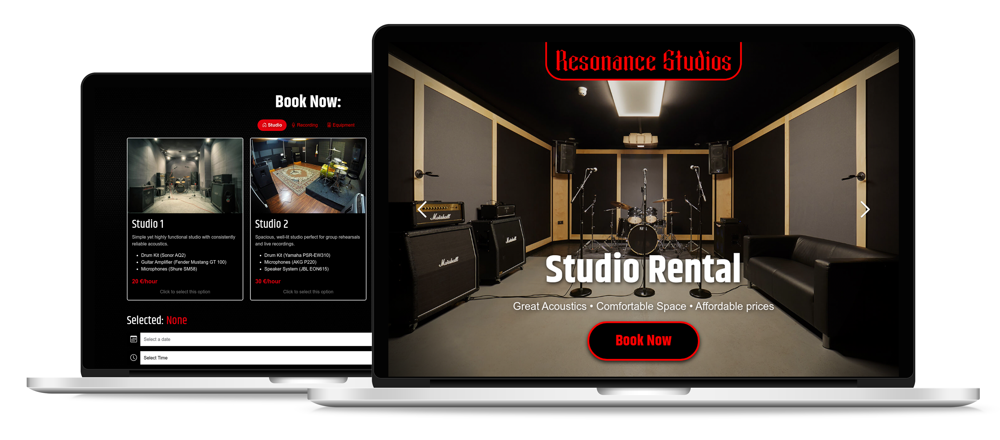

# Resonance Studios landing Page
### https://oaf131.github.io/resonance-studios
### UI/UX • Web Design • Front-End Development 

This project involved creating a responsive and visually engaging landing page for Resonance Studios, a music studio providing rehearsal rooms, recording services, and equipment rental!

---



## Features

- 📜 **Service Information**: Comprehensive descriptions of offered services.
- 🎨 **Modern Design**: Fully responsive for mobile, tablet, and desktop.
- 🚀 **Built with Bootstrap**: Fast and efficient styling with the Bootstrap framework.

---

## Design Process

The design process for the landing page included the following steps:

1. **Business Analysis**: Conducted an overview of the business to identify key goals and audience needs.
2. **User Persona Creation**: Developed a detailed character profile to understand the target audience's preferences.
3. **Value Proposition Canvas**: Defined the unique value the landing page would deliver to its users.
4. **Color and Typography Selection**: Carefully chosen colors and fonts to create an appealing and cohesive visual identity.
5. **Prototype Development and Testing**: Created and tested a functional prototype to ensure a seamless user experience in accordance with UI/UX principles.

---

## Built With

- **HTML5**: For page structure.
- **CSS3**: For styling and responsiveness.
- **JavaScript**: For interactivity.
- **Bootstrap 5**: For faster and consistent styling.

---

## Project Structure

```
/
├── index.html          # Main landing page
├── styles/
│   ├── style.css       # Custom styles
│   ├── flatpickr-custom.css # Custom calendar
├── scripts/
│   ├── script.js       # Custom scripts
├── images/ 
│   ├── background.jpg  # Graphics
 
```

---

## Live Preview

Check out the full presentation on Behance:  [Resonance Studios Landing Page](https://www.behance.net/gallery/216367791/Resonance-Studios-Landing-Page)

## Contact

- 📧 Email: [konstantin.webdev.01@gmail.com](mailto:konstantin.webdev.01@gmail.com)
